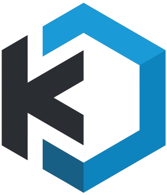

<h1 align="center">
   
  
  
   
  CyberEthical.Me Kasm Workspaces Registry
   
</h1>

# How to use

> This registry should be imported to your Kasm installation.

Detailed instructions can be found [TODO here](https://blog.cyberethical.me).

🔸How to install 3rd party registries:  
https://kasmweb.com/docs/latest/guide/workspace_registry.html#rd-party-registry  
🔸Registry URL:  
https://cyberethicalme.github.io/kasm-registry/1.1/

# Available containers

|Name|Desciption|
|---|---|
|HTB Labs: AI Workspace|AI labs machine from CyberEthical.Me - decicated for HackTheBox Academy|

# Support

This registry is maintained only by me, so please be understanding - if you see something is not working as intented or you have an idea to extend the registry, create an issue and I will triage it when I have the time.

### Shared Responsibility

I put my effort to make sure everything contained in this repository fulfills its purpose, but supply chain disruptions happen. Please do make your own due dilligence before importing anything to your workspace.

That's said, this registry works withing Kasm Workspaces which is the intellectual property of Kasm Technologies, and part of the issues (like infrastructural or not related to the CyberEthical.Me workspaces) should be addressed by Kasm Technologies. Depending on your license, please make sure you report issues via the right channel.